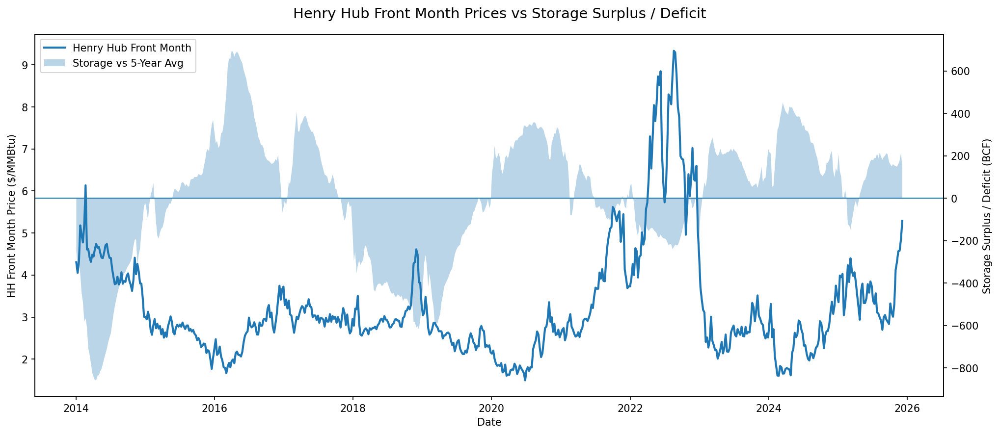

# US_natural_gas_storage
Analysis of Henry Hub reactions to US storage levels 

Underground storage of natural gas is used to balance seasonality in US gas demand. When demand is low in the summer, excess gas is injected into storage, so it can be withdrawn when demand is high in the winter. Inventories trending below five-year average levels signal deliverability risks during demand spikes. As a result, demand for prompt month contracts is likely to rise as LDCs and other end users attempt to secure more near-term volumes. Surplus inventories have the opposite effect, adding downward pressure to front-month contracts.

Market participants are accustomed to viewing the EIA's WNGSR through this lens, so this repo is simply pulling historical data to see how accurate this relationship is. The final output is the following chart, showing the reported surplus or deficit relative to the five-year average against prompt-month prices at Henry Hub on the Friday after the EIA's report is published. This passes a simple smell test by showing that surpluses do seem to dampen prices, while deficits seem to lift them. A naive correlation coefficient between the two variables = -0.4 indicating a moderate negative correlation. 

